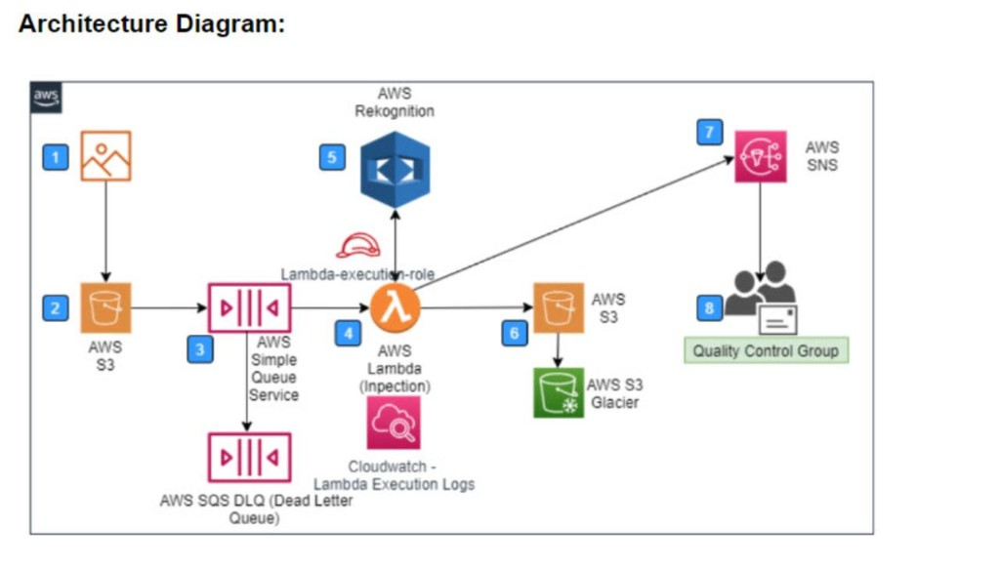
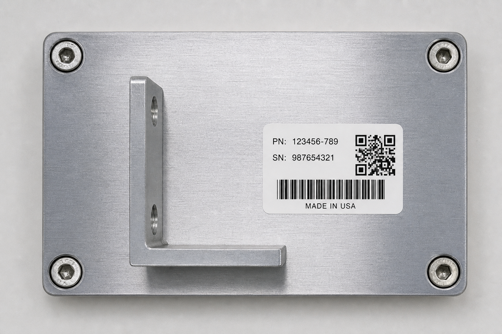
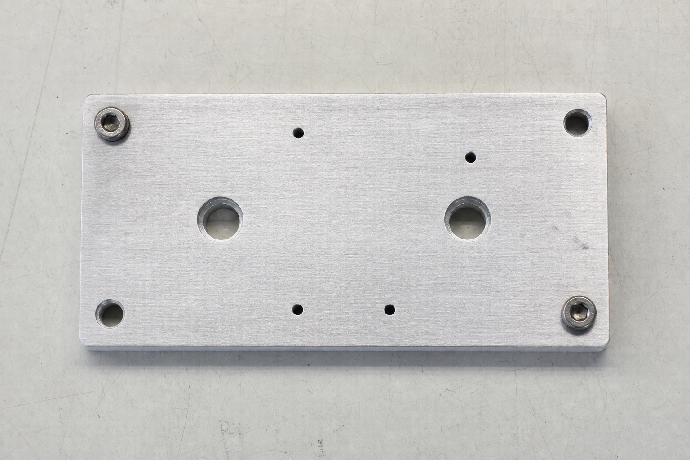

# InspectFlowAI
## Serverless Object-Detection Inspection on AWS

Automating Company X's manual widget quality inspection

<small>Team project | ITC6450 | AWS Academy Learner Lab</small>

---

## The problem

Company X inspects widgets **manually** today:

1. Worker photographs the widget on the assembly line
2. An inspector checks that every required component is present
3. Results are emailed to the Quality Control group
4. Image + results are filed in an "inspected" folder
5. Everything is retained **3 years** for compliance

**Goal:** fully automate this, serverless, event-driven.

---

## Our architecture



S3 (upload) → SQS (+DLQ) → Lambda → Rekognition → S3 archive (Glacier) + SNS → QC group
CloudWatch monitors every step.

---

## Why each component

| Component | Role |
|---|---|
| **S3 (source)** | Event source: camera drops the image here |
| **SQS + DLQ** | Decouples & buffers; failed images go to the DLQ |
| **Lambda** | The "inspector" — runs only on demand |
| **Rekognition** | Detects components (the automated inspection) |
| **S3 (inspected) + Glacier** | Archive + 3-year compliance retention |
| **SNS** | Notifies the Quality Control group |
| **CloudWatch** | Monitoring/observability for support |

---

## How the inspection decides PASS / FAIL

```python
detected = rekognition.detect_labels(image)        # e.g. screw, bracket, label
missing  = [c for c in EXPECTED_LABELS
            if c not in detected_names]
status   = "PASS" if not missing else "FAIL"
```

- `EXPECTED_LABELS` is configurable (no code change to retune)
- Image + JSON report archived to `inspected/pass/` or `inspected/fail/`
- SNS message sent with the result + any missing components

---

## Requirements → how we met them

| Requirement | Met by |
|---|---|
| Fully automated | S3 event → SQS → Lambda, zero human steps |
| Serverless + best practice | S3 / SQS / Lambda / Rekognition / SNS / Glacier |
| Event-based from the image | S3 `ObjectCreated` triggers everything |
| Image recognition | Rekognition `DetectLabels` |
| Notify QC group | SNS topic + subscription |
| Store results + image | Inspected bucket, pass/fail folders |
| 3-year retention | S3 lifecycle → Glacier, expire at 1095 days |

---

## Live demo — the two widgets

 

Compliant (left): hardware + QR label &nbsp;|&nbsp; Defective (right): missing bracket, label, screws

A widget passes only if Rekognition finds **all** of `hardware, qr code`.

```bash
./scripts/demo.sh dataset/01-compliant/compliant-metal-plate.png
./scripts/demo.sh dataset/06-non-widget/volleyball.png
```

---

## Live demo — full dataset (9 images, every combination)

Rule: `EXPECTED_LABELS = hardware|machine|motor, qr code` (`|` = synonyms)

| Scenario | Result |
|---|---|
| Compliant (hardware + QR) ×4 | **PASS** |
| Motor gearbox (`Machine`/`Motor` + QR) | **PASS** (via synonym) |
| Hardware only, no label | FAIL (missing qr code) |
| Hardware + text, no QR | FAIL |
| QR sticker only / label only | FAIL (missing hardware) |
| Non-widget (apple, volleyball) | FAIL |

**5 PASS / 7 FAIL** — each failure names the missing component.
Insight: rule vocabulary must match the labels the model emits → we use
**synonym groups** (and would use Custom Labels in production).

---

## Monitoring (support team)

- **CloudWatch dashboard `InspectFlowAI`**: Lambda invocations/errors/duration,
  SQS queue depth, DLQ depth
- **Alarm `inspectflow-dlq-not-empty`**: fires when an image fails inspection
  repeatedly and lands in the DLQ
- **CloudWatch Logs**: per-invocation bucket/key + PASS/FAIL trace

---

## Security & QA

- **SQS access policy**: only `s3.amazonaws.com` may send, scoped to our bucket
- **Least-privilege IAM** intent documented (Learner Lab uses `LabRole`)
- **Encryption** at rest (SSE) + in transit
- **Automated QA gate**: 9 unit tests (mocked AWS) run before deploy
- **Infrastructure as Code**: one-command deploy via CloudFormation/SAM

---

## Wrap-up

- Fully automated, serverless, event-driven inspection — **deployed and working**
- Idles at ~$0 (no EC2/NAT) — well within the $50 lab budget
- Future: Rekognition **Custom Labels** trained on real widgets;
  Step Functions for multi-stage inspection

# Questions?
